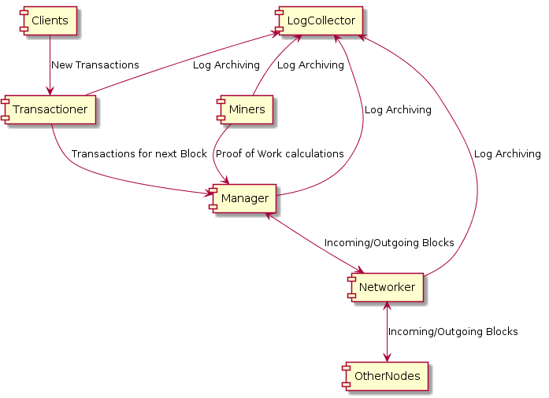

# Cryptocurrency System
This repository contains an implementation a simple Cryptocurrency with the following elements:

- Micro-services based architecture
- Custom Communication library built on raw unix sockets
- Modern, clean and consistent C++ code
- Custom single-line asynchronous thread-safe JSON logging with multiple output streams
- ETL-ready log collection and consolidation
- OpenSSL RSA signing

## High-Level System Design


## Modules
There are five main, inter-connected modules needed to run a single node. There is a readme for each module in their respective directories. The following table presents a high-level explanation of each:

| Module Name| Instances Per Node| Responsibilities | Connections |
|------------|--------|--------|---|
| Manager    | 1| Assembles the next block by requesting waiting transactions from the Transactioner module, and coordinates mining efforts of the Miner modules. Once proof of work is received from a Miner, it sends out the Block to the Networker module; to be propagated to other nodes. Also validates blocks from other nodes, absorbing them if they belong to a longer chain. | Miners, Transactioner, Networker, LogCollector |
| Miner    | 1..N| Continually tries to calculate the proof of work using a base value representing the in-progress block (Received from the Manager module). When proof of work is found, value is sent to the Manager module, and mining is suspended until Manager begins constructing a new Block.| Manager, LogCollector |
| Transactioner  | 1 | Accepts incoming transactions from clients. Holds all valid transactions in a waiting memory pool. A connected Manager module requests these transactions when space is available on the next block.| Manager, LogCollector |
| Networker    | 1 | Responsible for connections to other nodes. Propagates new blocks from the local Manager module to the outside world and forwards new external blocks for consumption by the Manager module. | Manager, LogCollector, Other Nodes (Networkers) |
| LogCollector    | 1 | Periodically gathers incoming local logs from the other modules. Once saved, a module is given permission to destroy their local copy. | Manager, Miners, Transactioner, Networker |

## Building System
This project uses CMake for building. This can be done in three steps:
1. Create build and bin directories within project directory.

```bash
mkdir build && mkdir bin
```

2. Run CMake inside build directory. Choose compiler with modern features and update library linkages in shared module (set up for gcc-8)

```bash
cd build && cmake .. -DCMAKE_CXX_COMPILER=<your_compiler_goes_here>
```

3. Run the 'make' command to produce binaries for each module within the bin folder.